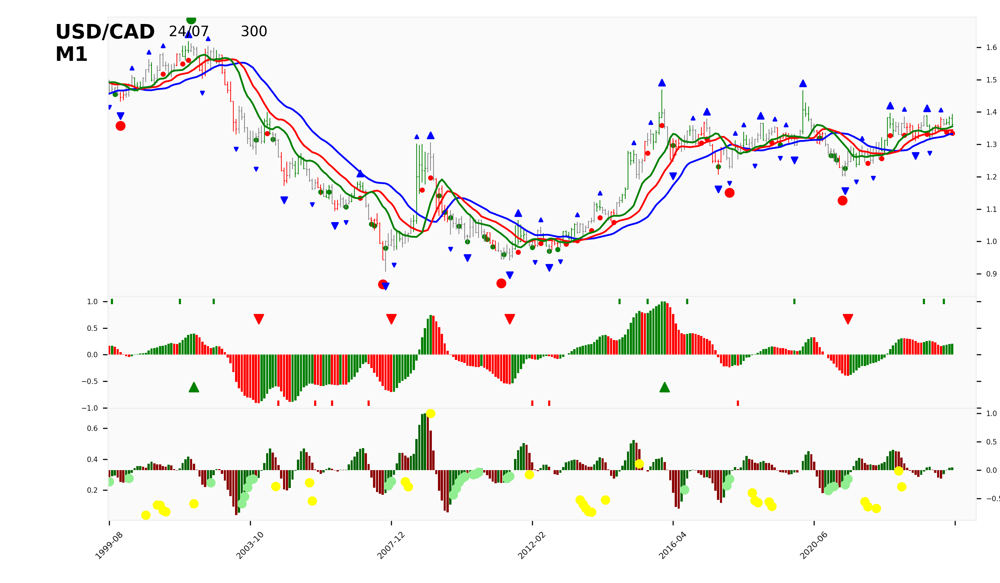
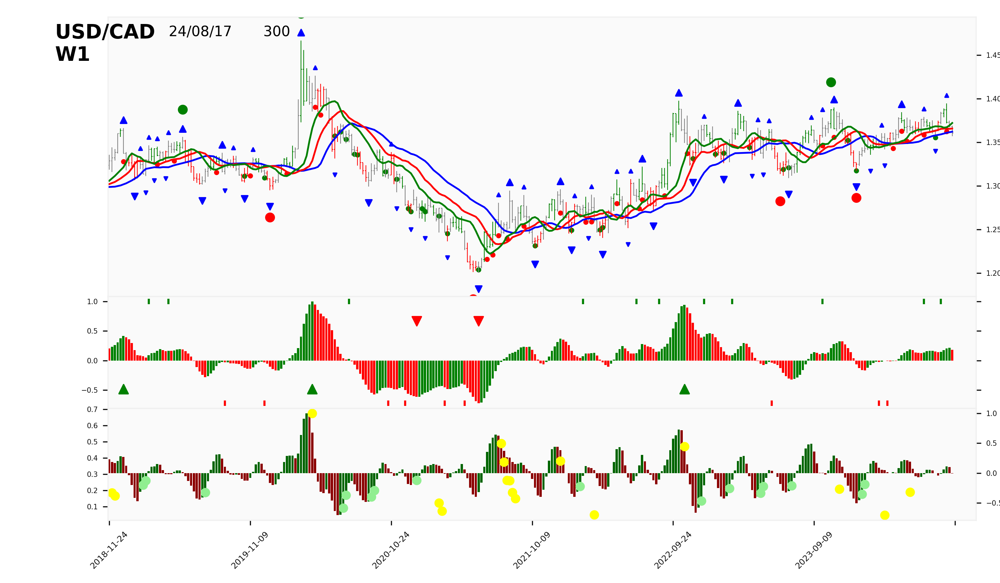
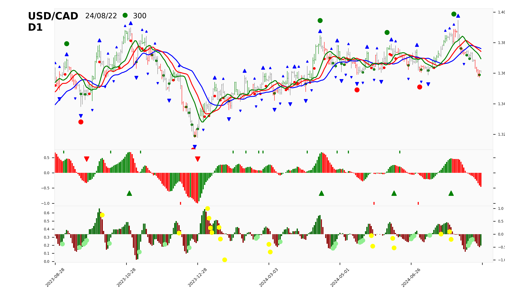
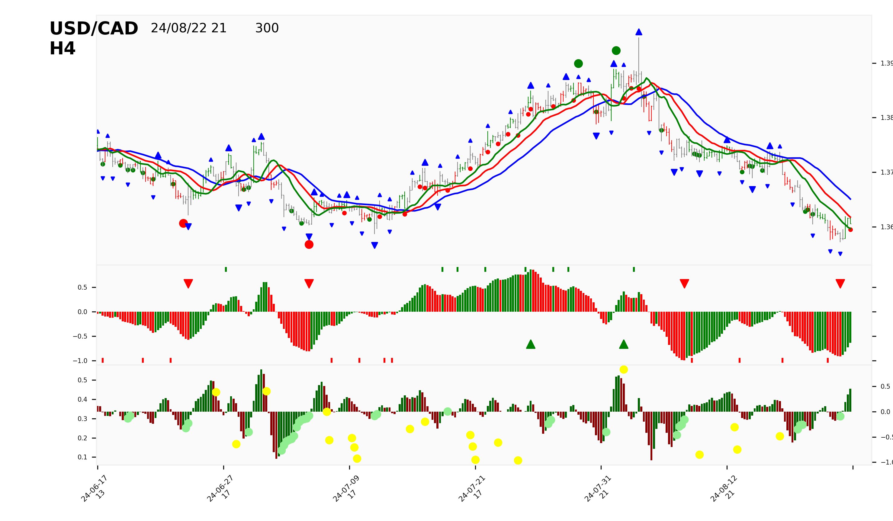

---
jupytext:
  cell_metadata_filter: -all
  formats: md:myst
  text_representation:
    extension: .md
    format_name: myst
    format_version: 0.13
    jupytext_version: 1.16.4
kernelspec:
  display_name: Python 3 (ipykernel)
  language: python
  name: python3
---

# Charting

+++

## Charts

#### M1/W1

::::{grid}
:gutter: 2

:::{grid-item}
:outline:

:::
:::{grid-item}
:outline:

:::

::::

#### D1/H4

::::{grid}
:gutter: 2

:::{grid-item}
:outline:

:::
:::{grid-item}
:outline:

:::

::::                                                                                                                                      

#### H1/m15

::::{grid}
:gutter: 2

:::{grid-item}
:outline:

:::
:::{grid-item}
:outline:

:::

::::

### No Format

## Signal

