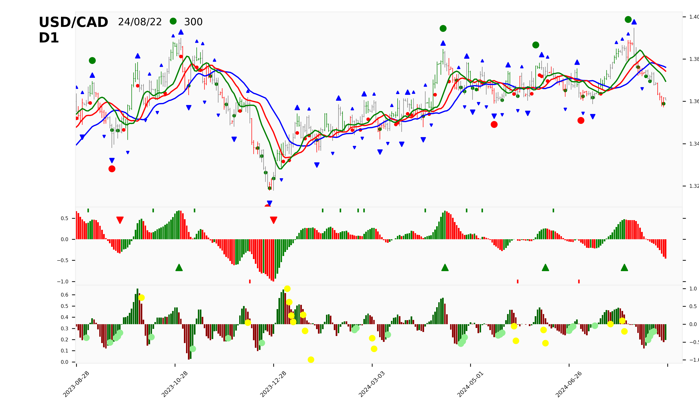

# Welcome to JGT Pto JuBOOK 2408a

This is a small sample book to give you a feel for how book content is
structured.
It shows off a few of the major file types, as well as some sample content.
It does not go in-depth into any particular topic - check out [the Jupyter Book documentation](https://jupyterbook.org) for more information.

## Signal chart 



## Table of content

```{tableofcontents}
```
