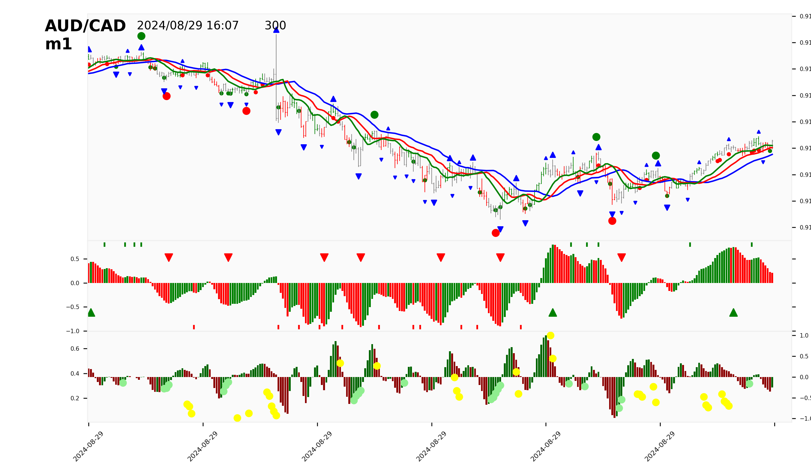

---
jupytext:
  cell_metadata_filter: -all
  formats: md:myst
  text_representation:
    extension: .md
    format_name: myst
    format_version: 0.13
    jupytext_version: 1.16.4
kernelspec:
  display_name: Python 3 (ipykernel)
  language: python
  name: python3
---


# Entry Signal Details
## Trade Information
- **Entry Rate:** 0.91581
- **Stop Rate:** 0.91602
- **Buy/Sell:** S
- **Lots:** 1
- **Tlid ID:** 240829114509
- **Instrument:** AUD/CAD
- **Timeframe:** m1


[M1](charts/M1.png)-[W1](charts/W1.png)-[D1](charts/D1.png)-[H4](charts/H4.png)-[H1](charts/H1.png)-[m15](charts/m15.png)-[m5](charts/m5.png)

----
## Utilities

+++

* [entry.sh](.jgt/entry.sh)
* [cancel.sh](.jgt/cancel.sh)
* [watch.sh](.jgt/watch.sh)
* [status.sh](.jgt/status.sh)
* [update.sh](.jgt/update.sh)
* [env.sh](.jgt/env.sh)
* Other scripts might include: .jgt/mv.sh, .jgt/rmtrade.sh, .jgt/xtrail.sh, .jgt/xfdb.sh

### CLI Commands

```{code-cell}
#.jgt/env.sh
#fxtr -id $OrderID $demo_arg
#fxrmorder -id $OrderID $demo_arg
#fxclosetrade -tid $trade_id $demo_arg
#fxtr -id $OrderID $demo_arg
#jgtapp fxwatchorder -id $OrderID  -d $bs \$demo_arg
#jgtapp fxmvstop -tid $trade_id -x $1 $demo_arg
#jgtapp fxrmtrade -tid $trade_id  $demo_arg
#jgtapp fxmvstopgator -tid $trade_id -i $instrument -t $timeframe --lips $demo_arg
#jgtapp fxmvstopfdb -tid $trade_id -i $instrument -t $timeframe  $demo_arg
#jgtapp fxstatusorder -id $OrderID  $demo_arg
```

#### More

* run 

```{code-cell}
#mkdir -p helps
#jgtapp --help > helps/jgtapp.txt
#fxtr --help > helps/fxtr.txt
```

### --@STCIssue Future Enhancements
* CLI Commands to run, not hard coded scripts
* Example : _fxtrupdate, _jgtsession_mksg, _jgtsession_vswsopen, _jgtsession_mkads_ctx_timeframe, _jgtsession_mkads_all_timeframes

+++

## Signal Bar Data
| Metric           | Value         |
|------------------|---------------|
| BidOpen | 0.91584 |
| BidHigh | 0.91592 |
| BidLow | 0.91583 |
| BidClose | 0.91586 |
| AskOpen | 0.91591 |
| AskHigh | 0.916 |
| AskLow | 0.91591 |
| AskClose | 0.91593 |
| Volume | 143 |
| Open | 0.915875 |
| High | 0.91596 |
| Low | 0.91587 |
| Close | 0.915895 |
| Median | 0.915915 |
| ao | 0.67981925977 |
| ac | 0.30034576336 |
| jaw | 0.91541824971 |
| teeth | 0.91551045298 |
| lips | 0.91564403345 |
| bjaw | 0.91595472027 |
| bteeth | 0.91556657957 |
| blips | 0.91541336255 |
| tjaw | 0.91626048448 |
| tteeth | 0.9166825167 |
| tlips | 0.91641093345 |
| fh | 0 |
| fl | 0 |
| fh3 | 0 |
| fl3 | 0 |
| fh5 | 0 |
| fl5 | 0 |
| fh8 | 0 |
| fl8 | 0 |
| fh13 | 0 |
| fl13 | 0 |
| fh21 | 0 |
| fl21 | 0 |
| fh34 | 0 |
| fl34 | 0 |
| fh55 | 0 |
| fl55 | 0 |
| fh89 | 0 |
| fl89 | 0 |
| mfi | 0.06293706294 |
| fdbb | 0 |
| fdbs | 1 |
| fdb | -1 |
| aoaz | 1 |
| aobz | 0 |
| zlc | 0.0 |
| zlcb | 0.0 |
| zlcs | 0.0 |
| zcol | gray |
| zone_sig | 0.0 |
| sz | 0.0 |
| bz | 0.0 |
| acs | 0.0 |
| acb | 0.0 |
| ss | 0.0 |
| sb | 0.0 |
| price_peak_above | 0 |
| price_peak_bellow | 0 |
| ao_peak_above | 0 |
| ao_peak_bellow | 0 |
| mfi_sq | 1 |
| mfi_green | 0 |
| mfi_fade | 0 |
| mfi_fake | 0 |
| mfi_sig | 1 |
| mfi_str | +- |

+++

## Current Bar Data
| Metric           | Value         |
|------------------|---------------|
| BidOpen | 0.91586 |
| BidHigh | 0.91589 |
| BidLow | 0.91586 |
| BidClose | 0.91587 |
| AskOpen | 0.91593 |
| AskHigh | 0.91596 |
| AskLow | 0.91593 |
| AskClose | 0.91594 |
| Volume | 14 |
| Open | 0.915895 |
| High | 0.915925 |
| Low | 0.915895 |
| Close | 0.915905 |
| Median | 0.91591 |
| ao | 0.71530535889 |
| ac | 0.23989916383 |
| jaw | 0.91542838435 |
| teeth | 0.91554102135 |
| lips | 0.91568322676 |
| bjaw | 0.91595213915 |
| bteeth | 0.91556486904 |
| blips | 0.91541223424 |
| tjaw | 0.91626357338 |
| tteeth | 0.9166792441 |
| tlips | 0.91640186447 |
| fh | 0 |
| fl | 0 |
| fh3 | 0 |
| fl3 | 0 |
| fh5 | 0 |
| fl5 | 0 |
| fh8 | 0 |
| fl8 | 0 |
| fh13 | 0 |
| fl13 | 0 |
| fh21 | 0 |
| fl21 | 0 |
| fh34 | 0 |
| fl34 | 0 |
| fh55 | 0 |
| fl55 | 0 |
| fh89 | 0 |
| fl89 | 0 |
| mfi | 0.21428571429 |
| fdbb | 0 |
| fdbs | 0 |
| fdb | 0 |
| aoaz | 1 |
| aobz | 0 |
| zlc | 0.0 |
| zlcb | 0.0 |
| zlcs | 0.0 |
| zcol | gray |
| zone_sig | 0.0 |
| sz | 0.0 |
| bz | 0.0 |
| acs | 1.0 |
| acb | 0.0 |
| ss | 0.0 |
| sb | 0.0 |
| price_peak_above | 0 |
| price_peak_bellow | 0 |
| ao_peak_above | 0 |
| ao_peak_bellow | 0 |
| mfi_sq | 0 |
| mfi_green | 0 |
| mfi_fade | 0 |
| mfi_fake | 1 |
| mfi_sig | 2 |
| mfi_str | -+ |
